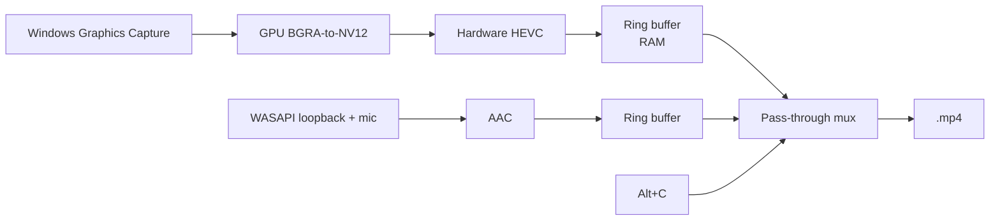

<div align="center">

# 🔴 clips

**Highly optimized instant replay for Windows 10/11**

</div>

---

## Why use clips?

- **No game impact!** Frames never leave the GPU: capture, color conversion, and scaling are all GPU passes, and encoding runs on the GPU's dedicated video silicon.
- **Instant saves!** The buffer is already HEVC-compressed, so saving is a remux, not a re-encode, and saves in 1/10th of a second.
- **No bloat!** One portable exe. No installer, no service, no account, no overlay.
- **Never dies!** A supervisor restarts capture/audio legs on device loss, monitor changes, audio device swaps, and panics. Built in Rust.

## Use

1. Run `clips.exe`. It will appear in the tray.
2. Something cool happens? Press <kbd>Alt</kbd>+<kbd>C</kbd>.
3. The clip saves to `Videos\Clips`, with a chime on success.

Everything else is in the tray menu:

| Option | Choices |
|---|---|
| Clip length | 15 / 30 / 60 s |
| Resolution | Native / 1440p / 1080p / 720p |
| Quality | High / Medium / Low (3.1 / 1.9 / 1.0 MB/s) |
| Microphone | Off / Default / specific device |
| Monitor | Primary or any attached display |
| Capture cursor | On / Off |
| Start with Windows | Registers the exe's current location, so keep it somewhere permanent |

## How it works


Video and audio share the QPC clock, so sync is exact with no resampling or drift correction. The ring holds encoded packets only (~140 MB for 60 s at default quality, hard-capped at 400 MB).

On **Windows 10**, where the capture API's yellow screen border can't be disabled, clips automatically falls back to DXGI Desktop Duplication: no border, same pipeline. Only caveat: the mouse cursor isn't captured there.

## Requirements

- Windows 10 / 11
- GPU with a hardware HEVC encoder (any non-ancient AMD / NVIDIA / Intel)

## Build

```
cargo build --release
```

Statically linked CRT, so the resulting `target/release/clips.exe` runs anywhere as-is.

Config lives at `%APPDATA%\InstantReplay\config.cfg`, logs next to it. Hidden keys there: `fps`, `gop_seconds`, `backend=auto|wgc|dxgi`, custom hotkey.

## Tests

```
cargo test                                   # ring buffer, config, mux unit tests
cargo run --release -- --record-test 8      # full pipeline: record, save, validate the MP4
```
